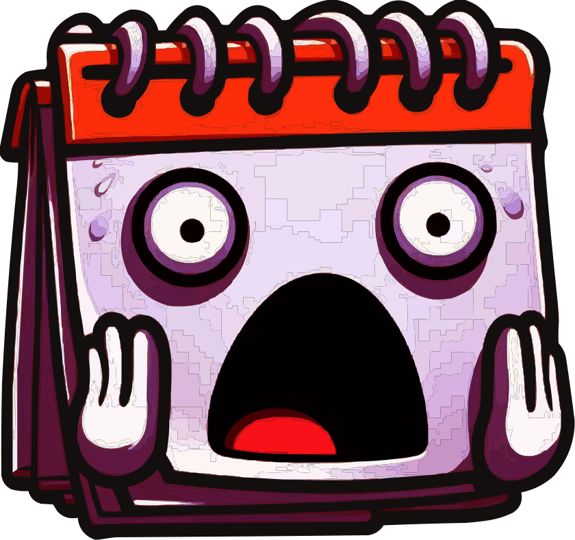

# FOMOcal - discover & share local events

Tired of missing great shows? **FOMOcal** helps you stay on top of your local music scene by creating tailored event calendars based on venue listings.

🎵 Discover events that match your taste.
📅 Export them to your calendar.
🤝 Share with friends to sync up.

## How it works

1. ➕ **Add a Venue**: Tell FOMOcal where to look! Configure how events can be
   [scraped](https://en.wikipedia.org/wiki/Web_scraping) from a venue’s program page.

   - Select the **event containers** (the boxes holding event details).
   - Relative to an event container, define [Scrape Jobs](ScrapeJob.md) to select and extract different [event details](#event-details).

2. ⛏ **Scrape the events** from the venue's program page.

3. 🔍 **Filter the list** by event details. Only interested in rock concerts? Apply filters to keep only what you care about.

4. ✨ **Select the events** you want to attend or share.

5. 🎁 **Export your selection** as
    - an [📆 iCalendar (.ics)](https://en.wikipedia.org/wiki/ICalendar) file for your calendar app
    - a rich, interactive HTML document containing a paged, searchable and sortable table with navigable links
    - plain text to share in a text message; in either a condensed format or column-aligned including headers
    - a [📊 CSV Data Export](https://en.wikipedia.org/wiki/Comma-separated_values) file.

    You can even share your venue configs with friends - so they can pull and browse the same listings.

### Event details
❗ *Name* and 📆 *Date* are **required**.

**Optional** details include ‼ *SubTitle*, 📜 *Description*, 🎶 *Genres*,
the 🏛 *Stage*, 🚪 *Doors* and 🎼 *Start* times, 💳 *Pre-sale* and 💵 *Doors price*,
an 📰 *Event page* and 🎫 *Tickets* links 📡 - and an 🖼 *Image*.

## What do I need?

Look for the latest build for your operating system in the **Assets** at the bottom of the [latest release](https://github.com/h0lg/FOMOcal/releases/latest).

On **Android**, look for the `FOMOcal x.x.x.apk`, download it to your phone and [side-load](https://en.wikipedia.org/wiki/Sideloading) it.
If you've never installed an app via side-loading, you'll probably first have to enable that in your Security settings, where it's called _installing apps from unknown sources_ or similar.

On **Windows**, download the `FOMOcal x.x.x win-x64.zip` and unzip it where you like.
It should run out of the box on recent Windows versions. If it doesn't, make sure you have the
[.NET 10 Runtime](https://dotnet.microsoft.com/en-us/download/dotnet/10.0/runtime) installed.
Note that the first app start may take quite long and require internet access to
[download an embedded browser in the background](https://learn.microsoft.com/en-us/microsoft-edge/webview2/concepts/evergreen-vs-fixed-version#the-evergreen-runtime-distribution-mode).

### How do I build from source?

You don't have to trust the uploaded bits. You can review the source and build from it yourself, targeting either Windows or Android using the [.NET SDK](https://dotnet.microsoft.com/en-us/download/visual-studio-sdks).
If building on Windows, you can simply run the `publish.cmd` scripts found in the respective [Platforms](https://github.com/h0lg/FOMOcal/blob/master/Gui/Platforms/) folder for your target.

Get the [current source](https://github.com/h0lg/FOMOcal/archive/refs/heads/master.zip) from the `Code` download widget above - and that for [older releases](https://github.com/h0lg/FOMOcal/releases) from one of the github-generated `Source code` archives in the _Assets_ at the bottom of each release.

## What's this about?

> TL;DR: Supporting small venues & upcoming bands by enabling easy grass-roots promotion.

Smaller venues hosting concerts often lack the professional promotion - or the social media guru -
to spread their events where they're easily discovered.
Instead, many of them **rely on their patrons visiting their web page**
to find out about the upcoming program like we did in the golden noughties.

Yet **your local music pub is vital to the diversity of the music ecosystem:
Lesser known bands depend on it** for a chance to play a gig - because for them,
established venues are often out-priced or simply not interested.
That's why it's not uncommon for **smaller locations** to **carry the interesting fringes of the music scene**.

### It's a team effort

This app is **intended for you, the patron of the fringe side of music** - to pick up the torch 🔥 and carry it for a little.
Lend those cool little local spots a hand by promoting their events - that way keeping them and your scene alive,
bringing people together for some good music and hopefully more great bands into your town in the future.

With FOMOcal you can support different scenes by **sharing relevant venues and their events in easily digestible formats**.
Go figure out how to get event info from the web page of a concert location and share the config with friends.
Or curate a list of good shows over the next few months for the music lovers yourself.

FOMOcal assumes you have no clue how web pages work or how to extract data from them - and tries to hand you the tools
and enough help for them to let you succeed anyway.
